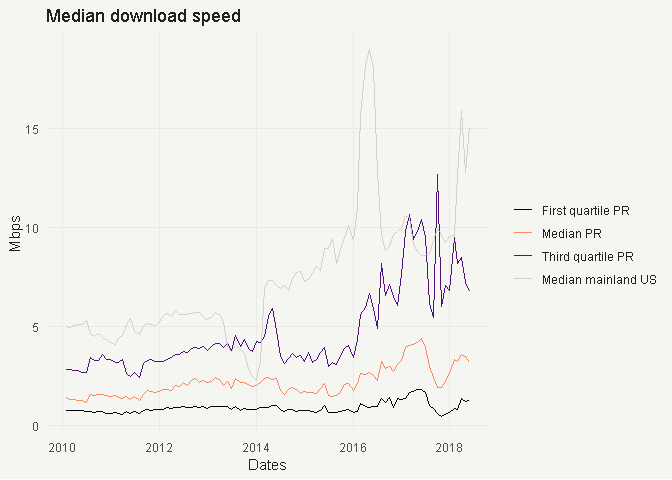
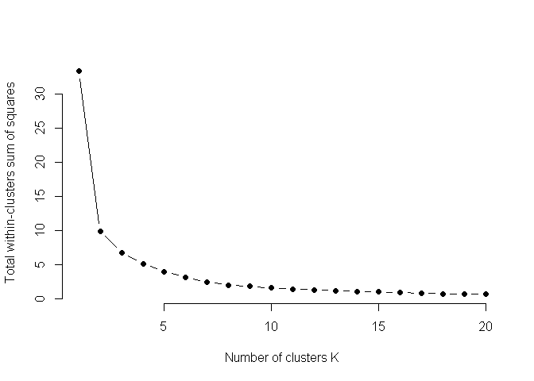
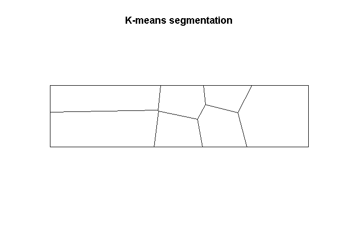
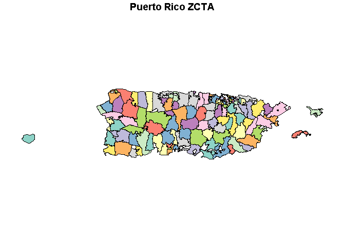
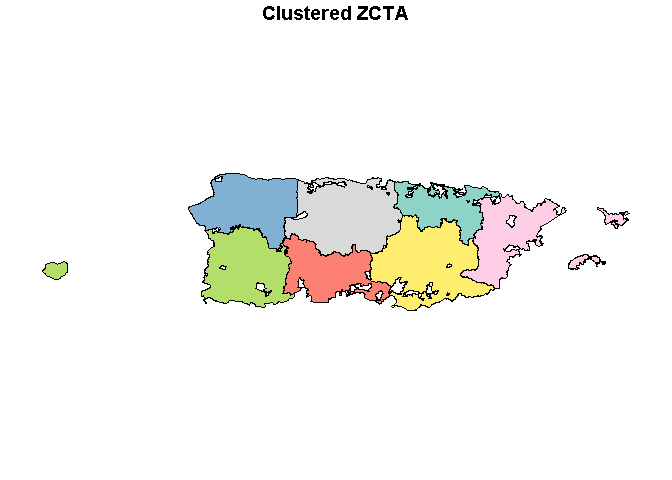
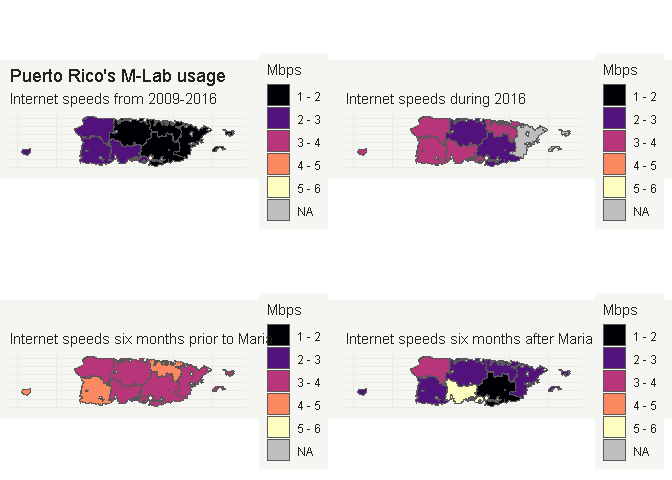

Puerto Rico Methodology
================
Nick Thieme
September 17, 2018

This is the methodology behind the NOVA story at \[insert link\]
================================================================

Loading packages and defining functions
---------------------------------------

This analysis makes use of many R packages and they're all loaded in this cell. There are also several user-defined mapping functions that are convinient for getting the data in the right shape to plot.

Using BigQuery to get M-lab data from the entire U.S. and Puerto Rico
---------------------------------------------------------------------

The first step in the analysis is to download the internet speed data from Puerto Rico. This is done using BigQuery. The code below will work perfectly for other states besides Puerto Rico so long as the geolocation country name is changed.

The first query is used to pull the download speed of every NDT test performed in Puerto Rico between 2009 and the present along with the IP address that performed the test.

The second query does something similar for the entire US but it skips a step because there is too much data to load locally. Instead, it uses bigQuery to compute the first, middle, and third quartiles of NDT test speeds for the entire US for every day from 2009 until the present. Because this data has already been aggregated, it doesn't make sense to also call the IP addresses.

``` r
options(warn=-1)
project <- "mlab-sandbox"
sql_fmt <- "#standardSQL
SELECT partition_date AS day, 8 *
(web100_log_entry.snap.HCThruOctetsAcked /
(web100_log_entry.snap.SndLimTimeRwin +
web100_log_entry.snap.SndLimTimeCwnd +
web100_log_entry.snap.SndLimTimeSnd)) AS d_mps, connection_spec.client_ip AS ip
FROM `measurement-lab.release.ndt_all`
WHERE 
connection_spec.data_direction = 1
AND web100_log_entry.snap.HCThruOctetsAcked >= 8192
AND (web100_log_entry.snap.SndLimTimeRwin +
web100_log_entry.snap.SndLimTimeCwnd +
web100_log_entry.snap.SndLimTimeSnd) >= 9000000
AND (web100_log_entry.snap.SndLimTimeRwin +
web100_log_entry.snap.SndLimTimeCwnd +
web100_log_entry.snap.SndLimTimeSnd) < 600000000
AND web100_log_entry.snap.CongSignals > 0
AND (web100_log_entry.snap.State = 1 OR
(web100_log_entry.snap.State >= 5 AND
web100_log_entry.snap.State <= 11))
AND connection_spec.client_geolocation.country_name = 'Puerto Rico';"
todo_copies <- query_exec(sql_fmt, project = project, use_legacy_sql=FALSE, max_pages = Inf)
```

    ## 180.1 gigabytes processed

``` r
todo_copies_org <- todo_copies
todo_copies$day<-str_sub(todo_copies$day,1,7)
todo_copies$day<-parse_date_time(todo_copies$day, "y-m")

sql_fmt <- "#standardSQL
SELECT
partition_date AS day, COUNT(connection_spec.client_ip) AS ip_count,
APPROX_QUANTILES(8 *(web100_log_entry.snap.HCThruOctetsAcked /(web100_log_entry.snap.SndLimTimeRwin +
web100_log_entry.snap.SndLimTimeCwnd +web100_log_entry.snap.SndLimTimeSnd)), 1000)[OFFSET(500)] AS d_mps_med,
APPROX_QUANTILES(8 *(web100_log_entry.snap.HCThruOctetsAcked /(web100_log_entry.snap.SndLimTimeRwin +
web100_log_entry.snap.SndLimTimeCwnd +web100_log_entry.snap.SndLimTimeSnd)), 1000)[OFFSET(250)] AS d_mps_fir,
APPROX_QUANTILES(8 *(web100_log_entry.snap.HCThruOctetsAcked /(web100_log_entry.snap.SndLimTimeRwin +
web100_log_entry.snap.SndLimTimeCwnd +web100_log_entry.snap.SndLimTimeSnd)), 1000)[OFFSET(750)] AS d_mps_thi
FROM `measurement-lab.release.ndt_all`
WHERE 
connection_spec.data_direction = 1
AND web100_log_entry.snap.HCThruOctetsAcked >= 8192
AND (web100_log_entry.snap.SndLimTimeRwin +
web100_log_entry.snap.SndLimTimeCwnd +
web100_log_entry.snap.SndLimTimeSnd) >= 9000000
AND (web100_log_entry.snap.SndLimTimeRwin +
web100_log_entry.snap.SndLimTimeCwnd +
web100_log_entry.snap.SndLimTimeSnd) < 600000000
AND web100_log_entry.snap.CongSignals > 0
AND (web100_log_entry.snap.State = 1 OR
(web100_log_entry.snap.State >= 5 AND
web100_log_entry.snap.State <= 11)) AND
connection_spec.server_geolocation.country_name = 'United States' 
GROUP BY 
day;"
todo_copies_USA <- query_exec(sql_fmt, project = project, use_legacy_sql=FALSE, max_pages = Inf)
```

    ## 179.9 gigabytes processed

``` r
todo_copies_USA$day<-str_sub(todo_copies_USA$day,1,7)
todo_copies_USA$day<-parse_date_time(todo_copies_USA$day, "y-m")%>%ymd
todo_copies_USA<-todo_copies_USA%>%group_by(day)%>%summarise("first"=median(d_mps_fir), "meds"=median(d_mps_med), "third"=median(d_mps_thi))
```

This next section isn't quite reproducible, but I want to be as transparent as possible. I recieved a special key to have access to a database that associates IP addresses with locations. I'm using this to make sure the locations of the data I have from M-Lab are as accurate as possible. I'm keeping that key and the data private, but I'd still like to report what I'm doing. The geolocation data is being imported as as JSON\_info\_full. This data frame contains the location of an IP, the autonomous system number (ASN) of the autonomous system the IP belongs to, as well as the company that owns that ASN.

On line 25 of this cell, I'm using "left\_join" to join the ip data (which includes longitudes and latitudes) with the speed data from BigQuery. After joining, lines 30 and 31 convert the data into a "spatial features" objects. These objects work wonderfully with tidy census and make the choropleth maps we eventually produce much easier to make.

``` r
setwd("C:/Users/nickt/OneDrive/Documents")
load("JSON_info_full")
D.time.s<-todo_copies
a<-map(map(JSON_info, "asn"), "name")
b<-map(JSON_info, "ip")
c<-map(map(JSON_info, "company"), "name")
d<-map(map(JSON_info, "loc")%>%str_split(","),1)
e<-map(map(JSON_info, "loc")%>%str_split(","),2)
rm.a<-which(lapply(a, length)==0)
rm.b<-which(lapply(b, length)==0)
rm.c<-which(lapply(c, length)==0)
rm.d<-which(lapply(d, length)==0)
rm.e<-which(lapply(e, length)==0)
rms<-c(rm.a,rm.b, rm.c, rm.d,rm.e)
a<-a[-rms]
b<-b[-rms]
c<-c[-rms]
d<-d[-rms]
e<-e[-rms]
isp_frame<-data.frame("ip"=unlist(b),"isp"= unlist(a), "company"=unlist(c), "lat"=unlist(d), "long"=unlist(e))
#tmp_frame<-left_join(ip_post_pair, isp_frame)
D.time.s<-read.csv("PR_SQL.csv")
D.time.s<-D.time.s[,-1]
D.sql.final <-left_join(D.time.s, isp_frame)%>%data.frame
```

    ## Joining, by = "ip"

``` r
D.sql.spatial<-D.sql.final%>%na.omit%>%filter(nchar(as.character(as.numeric(as.character(lat))))>5)
D.sql.spatial$lat<-as.numeric(as.character(D.sql.spatial$lat))
D.sql.spatial$long<-as.numeric(as.character(D.sql.spatial$long))
names(D.sql.final)<-c("day", "num","ip", "isp","company", "lat","long")
coordinates(D.sql.spatial)<- ~long+lat
D.sql.spatial<-as(D.sql.spatial, "sf")
```

Line plots over time
--------------------

This produces the most important plot in the story, which captures the long-term stagnation, the temporary improvements in 2016 and 2017, and the sustained drop in speed caused by Hurricane Maria. The heavy lifting is done by the function iqr, and that is defined in the first code cell above. The important thing to note is that iqr\_plot takes five inputs, three of which are cosmetic.

The first input, "D," is the principal dataset, and it will be split up by quartile and plotted in color. As can be seen by line 1, this dataframe should have the speeds grouped by ip and day. The second input, "D.to.join," is a reference dataset, and it will be used to produce the grey background lines. It's defined on line 58 of the BigQuery code block, but it comes almost directly from the BigQuery call on the entire US.

The other three inputs set the starting date for the graph, the title, and the legend labels, respectively.

One last thing to note, in line 1 I'm grouping by ip and day before calculating the median and sending that to iqr plot. What that means is that I calculate the median download speed for each ip on each day, and then iqr\_plot calculates the first quartile, median, and third quartile over each day of the ip medians. This prevents a single trigger-happy ip from tilting the daily median toward its download speed.

``` r
med.D<-D.sql.final%>%group_by(ip, day)%>%summarise("num"=median(num))
iqr_plot(D=med.D,
         D.to.join=todo_copies_USA,
         cutoff_date = ymd("2010-01-01"), 
         titles = "Median download speed",
         labs =  c("First quartile PR", "Median PR", "Third quartile PR","Median mainland US", 
                   "Third quartile mainland US"))
```

    ## Joining, by = "day"



Clustering for geographical analysis
------------------------------------

Now we're turning to the geographical analysis of NDT speeds over time. Because the density of users and tests is unequal spatially, it can be difficult to see geographical trends. However, by grouping together nearby ZCTA using clustering methods, it becomes easier to see the trends that are already there.

The first step in this kind of unsupervised clustering is deciding how many clusters to settle on. A common way of approaching this is the "elbow method." First, you calculate what the clusters would look like for many different cluster numbers and after getting the clusters, you calculate how similar the elements in one cluster are to one another for each cluster set.

You then plot that statistic, the "total within-cluster sum of squares," against the number of clusters that produced that WSS. Using the "elbow rule" means to choose the number of clusters at the "elbow" of the plot, the place where the initial sharp downard slope starts to flatten out.

The intuitive justification is that the elbow represents the value where increasing the number of clusters starts to garner diminishing returns. You're increasing the number of clusters (which is akin to overfitting, or further fitting this data as opposed to the population data) without getting back all that much more in-cluster similarity.

``` r
df<-D.sql.final[,c(7,6)]%>%na.omit%>%mutate_all(as.character)
lon.win <-c(-67.9518, -65.22464)
lat.win <-c(17.87082, 18.51871)
df<-df%>%na.omit%>%mutate_all(as.numeric)%>%filter((lon.win[2]>long)&(long>lon.win[1]))%>%
  filter((lat.win[2]>lat)&&(lat>lat.win[1]))%>%distinct
###checking number of clusters
set.seed(123)
# Compute and plot wss for k = 2 to k = 15.
k.max <- 20
data <- df
wss <- sapply(1:k.max, 
              function(k){kmeans(data, k,nstart=50,iter.max = 1000)$tot.withinss})
plot(1:k.max, wss,
     type="b", pch = 19, frame = FALSE, 
     xlab="Number of clusters K",
     ylab="Total within-clusters sum of squares")
```



Here that number appears to be between four and eight. We choose seven, and use this number to produce a segmentation of Puerto Rico into "tiles." Below are the k-means tiles and the ZCTA of Puerto Rico prior to combining the two.

``` r
setwd("C:/Users/nickt/OneDrive/Documents")
#To use this for the first time, run this commented code and save the object out. Then use the second line to load that saved object.
#pr_zcta <- zctas(state = "PR", year = 2010)
#pop <- get_acs(geography = "zcta",variables = "B19013_001",geometry=TRUE, cb=FALSE) %>%
  #filter(GEOID %in% pr_zcta$ZCTA5CE10)
load("pr_pop")
```

``` r
df1<-kmeans(df, 7, nstart = 100, iter.max = 1000)
W <- ripras(df1$centers, shape="rectangle")
W <- owin(c(-67.9518, -65.22464), c(17.87082, 18.51871))
X <- as.ppp(df1$centers, W=W) 
voronoi<-dirichlet(X)
```

    ## 
    ##      PLEASE NOTE:  The components "delsgs" and "summary" of the
    ##  object returned by deldir() are now DATA FRAMES rather than
    ##  matrices (as they were prior to release 0.0-18).
    ##  See help("deldir").
    ##  
    ##      PLEASE NOTE: The process that deldir() uses for determining
    ##  duplicated points has changed from that used in version
    ##  0.0-9 of this package (and previously). See help("deldir").

``` r
vor.tiles<- as(voronoi, "SpatialPolygons") 
vor.tiles.df<-SpatialPolygonsDataFrame(vor.tiles,data.frame(vor=1:length(vor.tiles)),match.ID=F)
###for most tracts this is unnecessary. just because pr data is weird. usually you can query straight to the area
locs<-pop$geometry
vor.sf<-as(vor.tiles.df, "sf")
vor.sf$vor<-as.factor(vor.sf$vor)
zcta.sf<-locs%>%st_sfc%>%st_sf
name<-1:nrow(zcta.sf)
zcta.sf$zcta = name
zcta.sf$zcta<-as.factor(zcta.sf$zcta)
st_crs(vor.sf)<-st_crs(zcta.sf)
st_int<-st_intersection(vor.sf, zcta.sf)
```

    ## although coordinates are longitude/latitude, st_intersection assumes that they are planar

``` r
attArea <- st_int %>%mutate(area = st_area(.) %>% as.numeric())
join_D<-attArea%>%as_tibble()%>%group_by(vor, zcta)%>%summarize(area = sum(area))%>%group_by(zcta)%>%
  summarise("shared_vor"=vor[which.max(area)])%>%group_by(shared_vor)
plot(vor.tiles, main="K-means segmentation")
```



``` r
plot(zcta.sf, main="Puerto Rico ZCTA")
```



Geographical analysis
---------------------

In this code chunk, I'm using the package tidycensus to get the shapes of every zipcode (ZCTA) in Puerto Rico. I'm then clustering the ZCTAs into groups according to their overlaps with the k-means tiles by taking the intersections of the two and assigning a ZCTA to a tile if over 50% of the area of that ZCTA is inside the tile. Below is the clustering of ZCTAs into larger regions for the purpose of geographical analysis.

``` r
st_crs(vor.sf)<-st_crs(zcta.sf)
st_int<-st_intersection(vor.sf, zcta.sf)
```

    ## although coordinates are longitude/latitude, st_intersection assumes that they are planar

``` r
attArea <- st_int %>%mutate(area = st_area(.) %>% as.numeric())
join_D<-attArea%>%as_tibble()%>%group_by(vor, zcta)%>%summarize(area = sum(area))%>%group_by(zcta)%>%
  summarise("shared_vor"=vor[which.max(area)])%>%group_by(shared_vor)

###this joins the zctas that are assigned to the same voronois
skip.list<-c()
for(i in 1:nrow(join_D)){
  vor.num<-join_D[i,]$shared_vor
  vor.inds<-which(join_D$shared_vor==vor.num)
  if(length(vor.inds)==1){
    next
  }else{
    if(i%in%skip.list){
      next
    }
    zcta.sf.ind<-which(zcta.sf$zcta%in%join_D[vor.inds,]$zcta)
    new.feat<-zcta.sf[zcta.sf.ind,]%>%st_union
    zcta.sf$geometry[zcta.sf.ind[1]]<-new.feat
    zcta.sf<-zcta.sf[(1:length(zcta.sf$geometry))[-zcta.sf.ind[-1]],]
    skip.list<-c(skip.list, vor.inds)
  }
}
plot(zcta.sf, main="Clustered ZCTA")
```



Geographical analysis
---------------------

One thing that's particularly nice about tidycensus and the spatial features, or "sf" objects, in R is that they allow for the easy aggregation of demographic and non-spatial data while performing spatial joins. The spatial clustering and joins above could cause real headache in trying to keep track of what data went with which ZCTA, but tidy census lets us augment our data with a flag I can use to re-join the newly clustered ZCTA regions with the old ZCTA data. That means assigning the Mbps data to the right place is a one-liner.

The join isn't particularly fast with 200k+ entries, but I only need to do it once to make the plots.

Here I make four plots of the NDT test speeds per region over four time periods: 2009-2016, 2016, 2017 up until Hurricane Maria, and from Hurricane Maria until today.

``` r
st_crs(D.sql.spatial)<-st_crs(zcta.sf)
D.joined<-st_join(D.sql.spatial, zcta.sf)
```

    ## although coordinates are longitude/latitude, st_intersects assumes that they are planar

``` r
D.joined.sum<-D.joined%>%data.frame%>%group_by(zcta,ip, day)%>%summarise("med"=median(d_mps))

num_title<-"Puerto Rico's M-Lab usage"
num_subtitle<-'Internet speeds from 2009-2016'
D.plot1<-D.joined.sum%>%data.frame%>%filter(ymd(day)%within%interval(ymd("2009-09-01"),ymd("2016-01-01")))%>%group_by(zcta)%>%
  summarise("n"=n(),"med"=median(med))%>%filter(n>2)%>%left_join(x=zcta.sf)%>%map_prep(c(1,2,3,4,5,6), NA_val="NA", no_classes=6)
```

    ## Joining, by = "zcta"

``` r
D.plot2<-D.joined.sum%>%data.frame%>%filter(ymd(day)%within%interval(ymd("2016-01-01"),ymd("2016-12-01")))%>%group_by(zcta)%>%
  summarise("n"=n(),"med"=median(med))%>%filter(n>2)%>%left_join(x=zcta.sf)%>%map_prep(c(1,2,3,4,5,6), NA_val="NA", no_classes=6)
```

    ## Joining, by = "zcta"

``` r
D.plot3<-D.joined.sum%>%data.frame%>%filter(ymd(day)%within%interval(ymd("2017-01-01"),ymd("2017-07-01")))%>%group_by(zcta)%>%
  summarise("n"=n(),"med"=median(med))%>%filter(n>2)%>%left_join(x=zcta.sf)%>%map_prep(c(1,2,3,4,5,6), NA_val="NA", no_classes=6)
```

    ## Joining, by = "zcta"

``` r
D.plot4<-D.joined.sum%>%data.frame%>%filter(ymd(day)%within%interval(ymd("2017-08-01"),ymd("2018-02-01")))%>%group_by(zcta)%>%
  summarise("n"=n(),"med"=median(med))%>%filter(n>2)%>%left_join(x=zcta.sf)%>%map_prep(c(1,2,3,4,5,6), NA_val="NA", no_classes=6)
```

    ## Joining, by = "zcta"

``` r
colors<-unique(c(D.plot1$colors, D.plot2$colors, D.plot3$colors, D.plot4$colors))
colors<-c(viridis::magma(length(colors)-1), "grey")

pre.plot<-D.plot1$data%>%ggplot(aes(fill=med), color=med)+geom_sf()+scale_fill_manual(values=colors,drop=FALSE,name="Mbps")+
labs(title=num_title, subtitle=num_subtitle)+theme(legend.position="none")+theme_map()

num_title<-""
num_subtitle<-'Internet speeds during 2016'

plot.2016<-D.plot2$data%>%ggplot(aes(fill=med), color=med)+geom_sf()+scale_fill_manual(values=colors,drop=FALSE,name="Mbps")+
  labs(title=num_title, subtitle=num_subtitle)+theme(legend.position="none")+theme_map()

num_title<-""
num_subtitle<-'Internet speeds six months prior to Maria'

pre.hurr<-D.plot3$data%>%ggplot(aes(fill=med), color=med)+geom_sf()+scale_fill_manual(values=colors,drop=FALSE,name="Mbps")+
  labs(title=num_title, subtitle=num_subtitle)+theme(legend.position="none")+theme_map()

num_title<-""
num_subtitle<-'Internet speeds six months after Maria'

post.hurr<-D.plot4$data%>%ggplot(aes(fill=med), color=med)+geom_sf()+scale_fill_manual(values=colors,drop=FALSE,name="Mbps")+
  labs(title=num_title, subtitle=num_subtitle)+theme(legend.position="none")+theme_map()

grid.arrange(pre.plot, plot.2016,pre.hurr,post.hurr)
```



It's important to check that the regional inequality we're seeing is real and not spurious. By grouping first by ip and isp, summarising, and then grouping by isp and summarising again, I get the median internet speed per isp while mitigating the impact a single user can have on their isp's median.

This part of the analysis won't be possible without using "JSON\_info\_full."

``` r
bb<-D.joined.sum%>%filter(zcta==4)%>%filter(ymd(day)>ymd("2017-09-01"))
bb.ip<-bb$ip
D.ponce <- D.sql.final%>%filter(ip%in%bb.ip)
D.ponce%>%group_by(isp,ip)%>%summarise("med"=mean(num))%>%arrange(desc(med))%>%group_by(isp)%>%
summarise("n"=n(),"med"=median(med))%>%arrange(desc(med))
```

    ## # A tibble: 9 x 3
    ##   isp                                        n    med
    ##   <fct>                                  <int>  <dbl>
    ## 1 AT&T Mobility Puerto Rico                  3 16.9  
    ## 2 Liberty Cablevision of Puerto Rico LTD   121  7.08 
    ## 3 Nustream Communications                    1  5.21 
    ## 4 DATACOM CARIBE, INC.                      59  4.04 
    ## 5 DM Wireless                                1  3.14 
    ## 6 OSNET Wireless                             5  3.08 
    ## 7 Aeronet Wireless                           2  3.02 
    ## 8 Open Mobile                                1  0.187
    ## 9 T-Mobile USA, Inc.                         1  0.178

This shows that we have data from close to 200 users in the Ponce region with speeds in the expected range.
